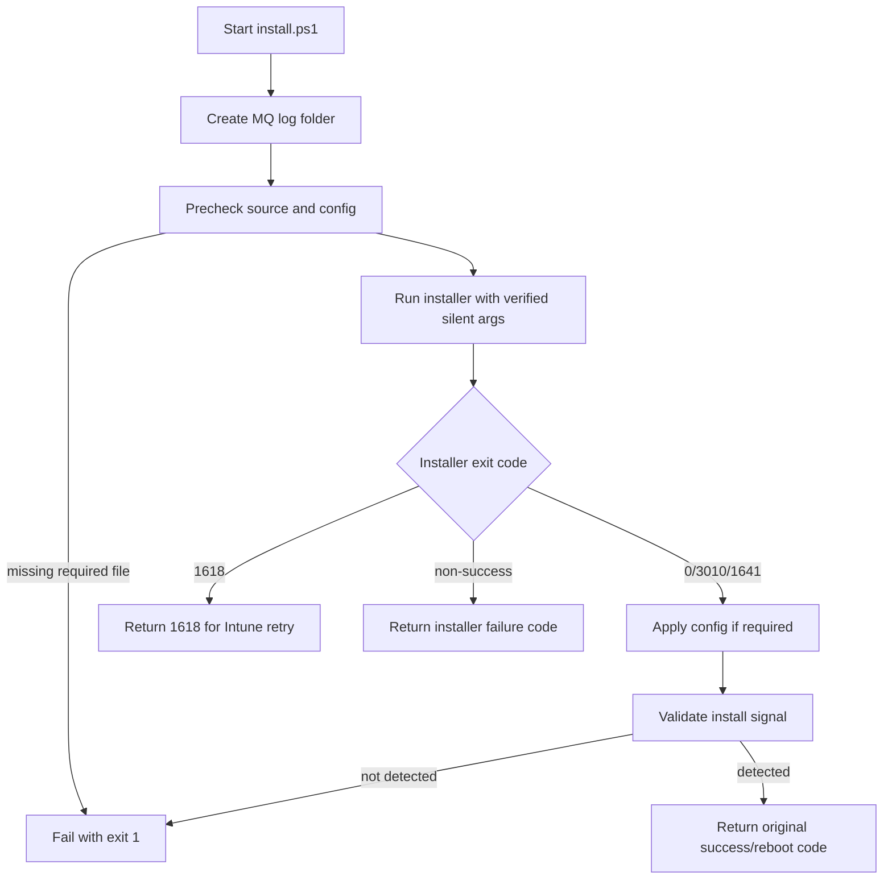

# Pre-Final Review Gate

Use this gate before generating the final `install.ps1` for a new package, or before making a material rewrite to an existing wrapper.

## When To Use

Show the review when the package details are mostly known and the next step would be to produce the final script.

Skip the gate only when:

- The user explicitly says to skip confirmation or generate directly.
- The user has already approved the same reviewed plan.
- The task is a narrow mechanical edit to an existing script and the change has no install-flow impact.

This gate is not generic intake. Do not ask broad questions if the required facts are already known. Ask the user to confirm or correct the reviewed plan.

## Review Format

Keep the review readable for EUC admins. Do not include full PowerShell code yet.

Return these sections:

1. **Package Summary**: vendor, app, version, architecture, install context, installer type.
2. **Source Layout**: flat `/source` file list or the user-provided tree.
3. **Install Command**: the installer executable and arguments that the wrapper will run. Redact secrets and activation keys.
4. **Install Logic**: short plain-language steps for precheck, install, config, validation, fallback, and completion.
5. **Flow**: Mermaid flowchart when supported; otherwise a numbered flow.
6. **Logs**: wrapper, transcript, and vendor/MSI log paths.
7. **Validation**: exact signal used to decide install success.
8. **Return Codes**: expected success, reboot, retry, and failure behavior.
9. **Fallbacks And Risks**: bootstrapper waits, unverified switches, missing vendor docs, config sensitivity, or user-context concerns.
10. **Confirmation Ask**: ask the user to confirm or correct the plan before final script generation.

## Mermaid Flow Template

Use concise labels. Keep it product-neutral and avoid secrets.



## Install Command Rules

- Show the effective command in a readable form, not as a final script block.
- Include the wrapper launcher separately from the vendor installer command.
- Redact secrets: `ACTIVATION_KEY=<redacted>`, `TOKEN=<redacted>`, `PASSWORD=<redacted>`.
- Mark evidence level: `official`, `installer-help`, `metadata`, `lab-tested`, or `unverified`.
- If a switch is unverified, say so and do not present the wrapper as production-ready.

## Confirmation Language

End with a direct, small ask:

```text
Please confirm this plan, or correct the install command, validation signal, license/config handling, or reboot behavior. After confirmation I will generate the final install.ps1.
```
